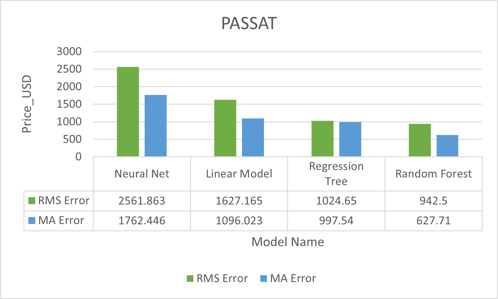

# Market_price_prediction_for_used_cars
## Implementing the finest data science techniques in R studio to build a machine learning model that could predict the selling price of used cars with 92% accuracy.

# Background
Carvana is an online platform that allows users/customers to sell and buy used cars and like numerous other brands we might want to expand the customer base of the website. It is often difficult for any customer to decide on what would be the best sale price of their car. Thus we came up with an idea to work on a new feature that will be able to suggest a sale price to a selling customer. This can be accomplished by building a predictive machine learning model using the previous sales history data and use this prediction as the suggestion price. Once executed the board members will need to assess the achievement rate and performance of the site.

# Goals
The predictive model will be summarized as a report to the board members of Carvana who could further test/validate the price suggestion feature (probably by launching it as a trial feature for one quarter) before its launch. This sheds light on how impactful the feature is on the customer base of Carvana. During the trial period, the customer base growth/shrinkage is strictly monitored and in order to justify if the growth/shrinkage is really a consequence of the new app feature, feedback is collected from targeted customers who must have used the feature. If growth is the consequence, the suggestion feature can take its place on the website to be fully functional. Once convinced, they would invest higher volumes of budget into the project for gathering more data and make the app more reliable

